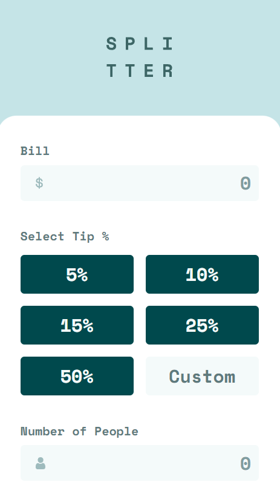
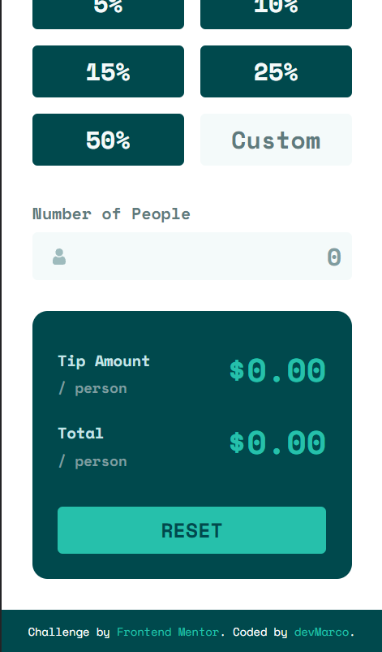
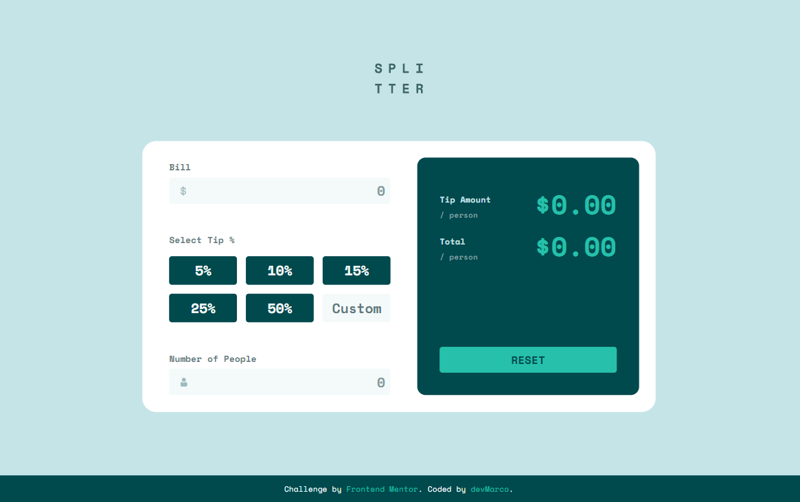

# Frontend Mentor - Tip calculator app solution

This is a solution to the [Tip calculator app challenge on Frontend Mentor](https://www.frontendmentor.io/challenges/tip-calculator-app-ugJNGbJUX). Frontend Mentor challenges help you improve your coding skills by building realistic projects.

## Table of contents

- [Overview](#overview)
  - [The challenge](#the-challenge)
  - [Screenshot](#screenshot)
  - [Links](#links)
- [My process](#my-process)
  - [Built with](#built-with)
- [Author](#author)

## Overview

### The challenge

Users should be able to:

- View the optimal layout for the app depending on their device's screen size
- See hover states for all interactive elements on the page
- Calculate the correct tip and total cost of the bill per person

### Screenshot

### Links

- Solution URL: [https://www.frontendmentor.io/solutions/tip-calculator-app-using-react-and-sass-Oqxjkhtsb](https://www.frontendmentor.io/solutions/tip-calculator-app-using-react-and-sass-Oqxjkhtsb)
- Live Site URL: [https://devmarco02-tip-calculator.netlify.app/](https://devmarco02-tip-calculator.netlify.app/)

## My process

### Built with

- Semantic HTML5 markup
- Sass
- Mobile-first workflow
- [React](https://reactjs.org/) - JS library

## Author

- Website - [devMarco02](https://devmarco02.netlify.app/)
- Frontend Mentor - [https://www.frontendmentor.io/profile/devMarco02](https://www.frontendmentor.io/profile/devMarco02)
